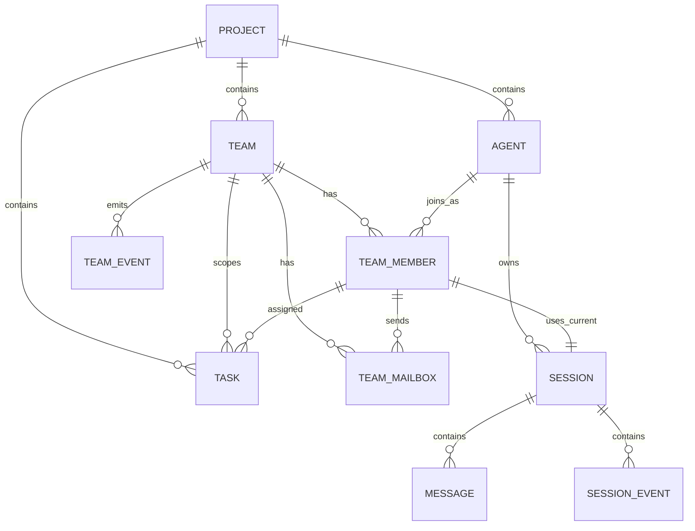
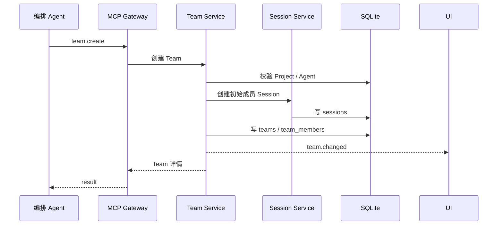
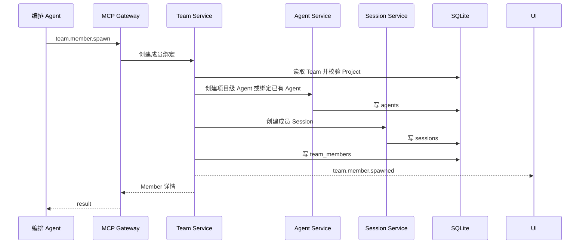
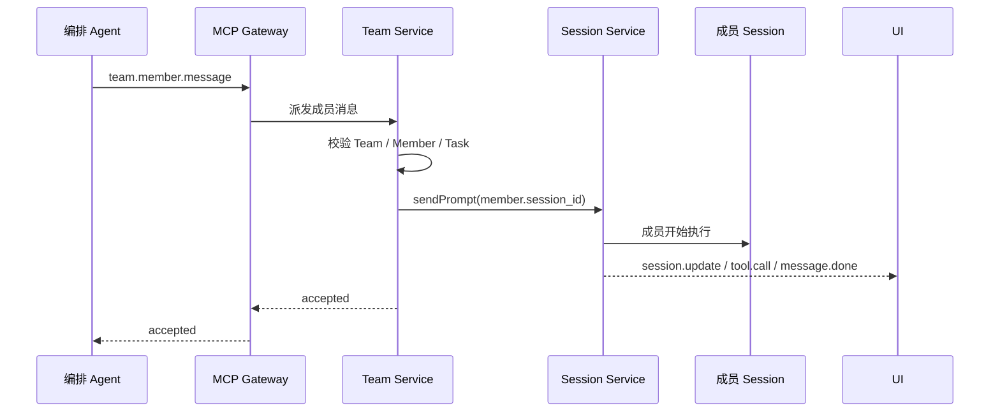
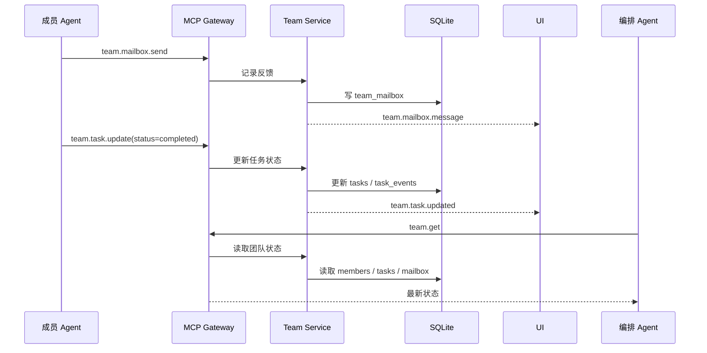

# Team MCP 工具架构设计

## 1. 设计目标

Team MCP 工具用于让 Agent 通过平台能力组织多 Agent 协作。

核心目标：

- 平台把 Team、Member、Task、Mailbox 等团队能力发布成 MCP tools。
- 工具本身只表达业务动作，不内置复杂权限判断。
- 谁能看到哪些工具，由现有 MCP token 可见性控制。
- Team 成员本质上复用现有 Project、Agent、Session、Task、Message/Event 体系。

一句话：

```text
Team 是项目级协作容器，Team Member 是 Agent + Session 在某个 Team 中的成员绑定，Team MCP 工具是 Agent 操作这个协作容器的方式。
```

---

## 2. 权限边界：工具不判角色，token 控可见性

Team 工具 handler 不判断“调用者是不是 Leader”。

例如工具里不写：

```text
if role !== leader then deny
```

权限边界放在 MCP 工具可见性层：

```text
MCP token.visibleTools 决定 Agent 能看到哪些 team.* 工具
```

因此：

- 能看到 `team.member.spawn`、`team.member.message` 的 Agent，就具备编排能力。
- 只能看到 `team.task.update`、`team.mailbox.send` 的 Agent，就是普通协作成员。
- 只能看到 `team.get`、`team.task.list` 的 Agent，就是只读观察者。

工具 handler 只负责业务一致性：

- team 是否存在
- team 是否属于当前 project
- member 是否属于这个 team
- task 是否属于这个 team / project
- 当前会话上下文是否能定位到有效 project/team/member

---

## 3. Team 数据模型

### 3.1 实体关系



### 3.2 实体职责

| 实体 | 作用域 | 职责 |
|---|---|---|
| Project | 全局项目级 | 代码目录和工作上下文 |
| Agent | 项目级 | 可运行的智能体实例，由模板部署或手动创建 |
| Session | Agent 会话级 | 单次对话/执行上下文，保存 messages 和 session_events |
| Team | 项目级 | 多 Agent 协作容器，属于一个 Project |
| TeamMember | Team 级 | Agent 在某个 Team 中的成员绑定，持有当前团队会话 |
| Task | 项目级，可选 Team 关联 | 平台任务；Team Task 是现有 Task 的团队关联形态 |
| TeamMailbox | Team 级 | 团队内异步留言、问题、汇报和结果记录 |
| TeamEvent | Team 级 | 团队成员、任务、留言等协作事件流 |

---

## 4. Team 与现有 Task 的关系

Team 不单独建立另一套任务系统。

目标模型是复用现有 `tasks` 表，把团队任务表达为带 Team 关联的普通 Task：

```text
Task
  project_id          仍然表示任务属于哪个项目
  team_id             可选，表示任务属于哪个 Team
  assignee_member_id  可选，表示任务分配给哪个 Team Member
  assigned_agent_id   仍可保留，表示最终关联的 Agent
```

这样做的好处：

- 项目任务看板和团队任务看板看到的是同一批任务。
- 不需要维护 `tasks` 和 `team_tasks` 两套状态机。
- 现有 `taskStore`、`task_events`、前端任务页可以逐步复用。

Team task 的定义：

```text
team_id 不为空的 Task，就是 Team Task。
```

任务完成不需要单独建 `team.task.finish`。

完成任务就是更新任务状态：

```text
team.task.update(status = completed)
```

如果后续 Agent 对“完成任务”表达不稳定，可以把 `team.task.finish` 作为语义糖加入，但底层仍等价于 `team.task.update(status=completed)`。

---

## 5. Agent、Member、Session 生命周期边界

### 5.1 Agent 能否属于多个 Team

允许同一个项目级 Agent 加入多个 Team。

但每个 Team membership 独立：

```text
同一个 Agent
  ├─ 在 Team A 中是 member-a，使用 session-a
  └─ 在 Team B 中是 member-b，使用 session-b
```

Agent 是项目级资源，TeamMember 是 Team 内的绑定关系。

### 5.2 Team Member 的 Session

每个 TeamMember 持有一个“当前团队会话”：

```text
team_member.session_id -> sessions.id
```

这个 session 仍然是普通 Session：

- messages 存在 `messages`
- 工具调用和流式事件存在 `session_events`
- 前端刷新后通过 Session 事件恢复对话和工具调用

Team 页面只是把这些 Session 按成员组织起来展示。

### 5.3 Spawn 创建出来的 Agent 如何处理

`team.member.spawn` 可以从 Agent 模板创建项目级 Agent，也可以把已有 Agent 加入 Team。

生命周期规则：

| 场景 | 规则 |
|---|---|
| 从模板 spawn | 创建新的项目级 Agent，再创建 TeamMember 绑定 |
| 加入已有 Agent | 不复制 Agent，只创建 TeamMember 绑定 |
| 删除 Team | 默认只归档 Team、TeamMember 和团队会话，不硬删除 Agent |
| 删除 Member | 默认移除 TeamMember 绑定，保留 Agent 和历史 Session |

原因：Agent 是项目级资源，直接随 Team 删除可能造成数据丢失。是否清理“只为团队创建的 Agent”，可以后续在 UI 上做显式选项。

---

## 6. Team MCP Context 注入

成员 Agent 不能靠 prompt 文本记住 `teamId`。

Team Session 创建 MCP token 时，平台应把团队上下文写入工具上下文：

```text
ToolContext
  projectId
  agentId
  sessionId
  teamId
  teamMemberId
```

工具解析规则：

- 如果输入显式传 `teamId`，工具校验它必须等于 context.teamId 或属于 context.projectId。
- 如果输入不传 `teamId`，工具优先使用 context.teamId。
- 如果输入不传 `memberId` 且工具需要“当前成员”，工具使用 context.teamMemberId。

这样成员调用：

```text
team.mailbox.send(content="测试已完成")
team.task.update(taskId="...", status="completed")
```

也能自动落到正确 Team，不需要 Agent 每次在 prompt 里抄 teamId。

---

## 7. `team.member.message` 与 `team.mailbox.send`

这两个工具必须分开。

| 工具 | 是否触发 Agent 执行 | 语义 | 典型用途 |
|---|---:|---|---|
| `team.member.message` | 是 | 给某个成员派活，让它的 Session 开始执行 | “测试工程师，去补 auth 测试” |
| `team.mailbox.send` | 否 | 留言、汇报、提问、记录结果 | “测试已补齐，12 个用例通过” |

如果合成一个工具，Agent 很容易搞混：

```text
“我完成了”到底是给别人派新活，还是记录自己完成了？
```

分开后语义更清晰：

```text
派活 = team.member.message
反馈 = team.mailbox.send + team.task.update
```

---

## 8. 异步执行模型

`team.member.message` 是异步派活。

异步含义：

```text
调用方不等待目标 Agent 完整执行完成。
```

调用后平台只返回投递结果：

```text
accepted
```

目标成员的后续输出走它自己的 Session：

```text
member.session_id
  ├─ messages
  └─ session_events
      ├─ message.chunk
      ├─ tool.call
      ├─ tool.update
      └─ message.done
```

这样可以让多个成员并行执行，不会让编排 Agent 的一次 MCP tool call 卡几分钟。

---

## 9. 工具目录

### 9.1 Team 查询与管理

| 工具 | 语义 | 主要结果 | 可见性建议 |
|---|---|---|---|
| `team.list` | 列出当前项目的 Team | teams | 只读 / 协作 / 编排 |
| `team.get` | 获取 Team、Members、任务摘要、最近 mailbox | team detail | 只读 / 协作 / 编排 |
| `team.create` | 创建 Team，并绑定一个初始主控成员 | team + member + session | 编排 |
| `team.update` | 修改 Team 元信息 | updated team | 编排 |

### 9.2 成员编排

| 工具 | 语义 | 主要结果 | 可见性建议 |
|---|---|---|---|
| `team.member.list` | 列出 Team 成员 | members | 只读 / 协作 / 编排 |
| `team.member.spawn` | 从模板创建成员，或把已有 Agent 加入 Team | member + agent + session | 编排 |
| `team.member.message` | 给成员派活，触发成员 Session 执行 | dispatch status | 编排 |

### 9.3 Mailbox 协作

| 工具 | 语义 | 主要结果 | 可见性建议 |
|---|---|---|---|
| `team.mailbox.list` | 查看团队留言、问题、结果 | mailbox messages | 协作 / 编排 |
| `team.mailbox.send` | 写入留言、问题、结果或汇报 | mailbox message | 协作 / 编排 |

### 9.4 Team Task

| 工具 | 语义 | 主要结果 | 可见性建议 |
|---|---|---|---|
| `team.task.list` | 查看 Team 关联任务 | tasks | 只读 / 协作 / 编排 |
| `team.task.create` | 创建 Team 任务，可指派成员 | task | 编排 |
| `team.task.update` | 更新任务状态、进度、指派成员 | task | 协作 / 编排 |

### 9.5 模板发现

| 工具 | 语义 | 主要结果 | 可见性建议 |
|---|---|---|---|
| `team.template.list` | 列出可用于 spawn 的 Agent 模板 | templates | 编排 |
| `team.template.describe` | 查看模板能力说明 | template detail | 编排 |

---

## 10. 可见性 Profile

工具可见性可以配置成几类 Profile。Profile 只是配置示例，不是工具内置权限。

| Profile | 可见工具 |
|---|---|
| 只读观察者 | `team.list`, `team.get`, `team.member.list`, `team.task.list`, `team.mailbox.list` |
| 协作成员 | 只读工具 + `team.mailbox.send`, `team.task.update` |
| 编排成员 | 协作工具 + `team.create`, `team.update`, `team.member.spawn`, `team.member.message`, `team.task.create`, `team.template.list`, `team.template.describe` |

---

## 11. 协作流程

### 11.1 创建 Team



### 11.2 Spawn 成员



### 11.3 派活给成员



### 11.4 成员反馈与完成任务



---

## 12. 异常与并发原则

### 12.1 目标 Agent 不可用

当 `team.member.message` 触发成员 Session 时：

- 如果目标 Session 不存在，工具调用直接失败。
- 如果 runtime 启动或 prompt 执行失败，失败会进入目标成员 Session 的生命周期事件和日志。
- 调用方已收到 `accepted`，需要通过 `team.get`、目标 Session 事件或 mailbox 跟踪后续状态。

### 12.2 成员正在执行中

同一个 TeamMember 同时只允许一个 active turn。

当成员正在执行中再次收到 `team.member.message`：

- 底层 Session 会拒绝并记录“当前会话正在生成中”的失败事件。
- `team.member.message` 不隐式排队，避免隐藏大量未执行任务。
- 编排 Agent 可以通过目标 Session 事件发现失败后稍后重试，或 spawn / 选择其他成员。

如果后续需要排队，应该显式引入队列概念，而不是让 `team.member.message` 静默排队。

### 12.3 Session 被关闭或删除

TeamMember 的 `session_id` 是当前团队会话指针。

- 如果 Session 被关闭，成员状态变为 `idle` 或 `disconnected`。
- 下次派活时可以创建新的 Team Session，并更新 TeamMember 的 `session_id`。
- 旧 Session 作为历史保留，便于审计和查看。

### 12.4 Team 删除

Team 删除默认是软删除 / 归档语义：

- Team 不再出现在普通列表。
- TeamMember 关系不再活跃。
- Team Session 保留为历史。
- Agent 不随 Team 自动硬删除。

### 12.5 Mailbox 不触发执行

`team.mailbox.send` 永远只记录消息，不启动 Agent。

如果要让某个成员执行，必须使用 `team.member.message`。

---

## 13. 与 AionUi 的关系

AionUi 的 Team Mode 提供了参考方向：

- Leader + Teammates
- Leader 通过 Team MCP 工具 spawn 成员
- 每个成员有独立 conversation/session
- 成员共享 workspace
- 通过 mailbox / task board 汇报结果

AI IDE Studio 不照搬 AionUi 的 TCP Team MCP Server。

本项目采用已有 MCP 工具平台：

```text
HTTP MCP Gateway
  + token visibleTools
  + ToolContext(projectId, agentId, sessionId, teamId, teamMemberId)
  + 平台 Team Service / Store
```

这样 Team 能力和现有 Project、Agent、Session、Task、Tool 可见性模型保持一致。
